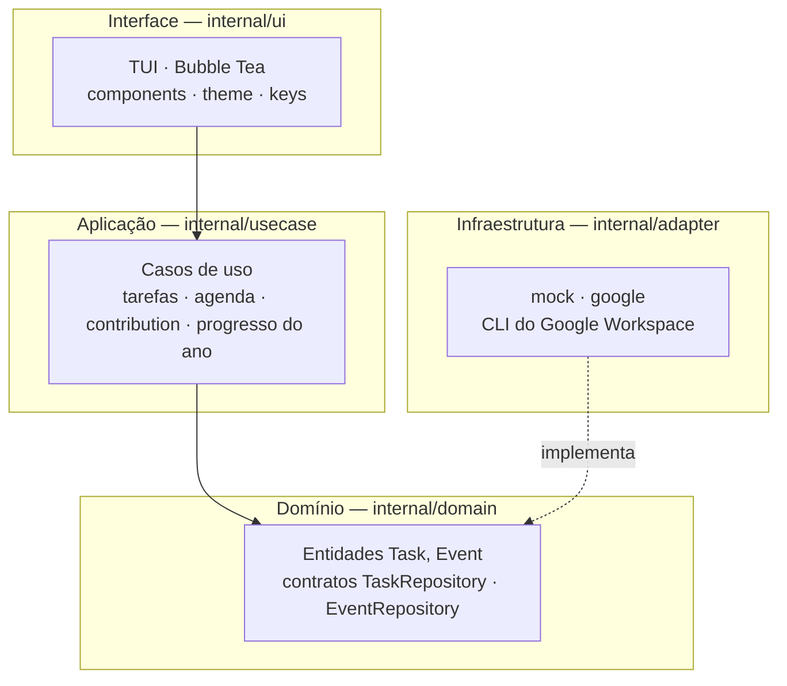

<div align="center">

# ⚡ tocli
### Painel de produtividade no terminal — tarefas, agenda e métricas


</div>

---

## 📖 Sobre

**Tocli** é um dashboard pessoal no terminal que agrupa **Google Tasks** (lista de tarefas), **Google Calendar** (agenda do dia) e **métricas visuais** estilo GitHub e barra de progresso do ano. A interface é totalmente orientada a teclado, com tema escuro e layout em painéis.

O backend de integração usa o **[Google Workspace CLI](https://github.com/googleworkspace/cli)** (execução de comandos), sem chamar diretamente as APIs REST do Google ideal para manter o domínio desacoplado e testável. No estado atual, o projeto inclui um **adaptador mock** para você rodar e explorar a TUI sem credenciais.

## Principais funcionalidades

| Funcionalidade | Descrição |
|----------------|-----------|
| **Lista de tarefas** | Painel esquerdo com tarefas abertas e concluídas recentes; conclusão com `Enter` / `Espaço`. |
| **Agenda do dia** | Eventos de hoje com horário, título e local; destaque para o que está em andamento. |
| **Contribution graph** | Grade anual de tarefas concluídas por dia, com intensidade de cor proporcional ao volume. |
| **Progresso do ano** | Percentual do ano decorrido, dias restantes e barra visual. |
| **TUI moderna** | [Bubble Tea](https://github.com/charmbracelet/bubbletea) + [Lipgloss](https://github.com/charmbracelet/lipgloss), navegação estilo vim (`hjkl` / setas) e atalhos inspirados em LazyGit / GitHub CLI. |

## Pré-requisitos

- **Go 1.22+** instalado ([go.dev/dl](https://go.dev/dl/)).
- Terminal com **suporte a cores** e, de preferência, **largura ≥ 100 colunas** para o layout em painéis.
- *(Opcional — modo produção)* **[Google Workspace CLI](https://github.com/googleworkspace/cli)** instalado e autenticado, se for usar os adaptadores em `internal/adapter/google` em vez do mock.

## Instalação

1. **Clone o repositório**:

```bash
git clone https://github.com/TETEURYAN/tocli.git
cd tocli
```

2. **Baixe as dependências e compile**:

```bash
go mod download
go build -o tocli .
```

## Configuração

Hoje não há arquivo `.env` obrigatório: o binário padrão usa **dados mock** em `internal/adapter/mock`.

Para usar o **CLI Google** no futuro, troque em `main.go` os repositórios mock por `google.NewTasksCLI` / `google.NewCalendarCLI` e ajuste flags e formato JSON conforme a versão do CLI na sua máquina. Os parsers ficam em:

- `internal/adapter/google/tasks_cli.go`
- `internal/adapter/google/calendar_cli.go`

## Uso

Para iniciar a aplicação:

```bash
go run .
```

Ou, após `go build`:

```bash
./tocli
```

A TUI abre em **tela alternativa** (fullscreen no terminal). **Sair:** `q` ou `Ctrl+C`. **Ajuda de atalhos:** `?`.

### Tarefas (painel esquerdo)

| Ação | Teclas |
|------|--------|
| Focar o painel | `Tab` / `Shift+Tab` até a borda destacada |
| Mover na lista | `↑` `↓` ou `k` `j` |
| Marcar como concluída | `Enter` ou `Espaço` |
| Atualizar dados | `r` |

### Agenda (direita, topo)

| Ação | Teclas |
|------|--------|
| Focar o painel | `Tab` / `Shift+Tab` |
| Mover entre eventos | `↑` `↓` ou `k` `j` |

### Contribution graph e barra do ano

| Ação | Teclas |
|------|--------|
| Recalcular métricas | `r` |
| Barra do ano | atualização automática + `r` |

### Atalhos globais

| Tecla | Função |
|-------|--------|
| `Tab` | Próximo painel |
| `Shift+Tab` | Painel anterior |
| `r` | Refresh (tarefas, eventos, gráfico) |
| `?` | Ajuda |
| `q` / `Ctrl+C` | Sair |

## Arquitetura

O projeto segue uma separação em camadas:



- **Domain** (`internal/domain`): entidades `Task`, `Event` e interfaces de repositório.
- **Use cases** (`internal/usecase`): listar tarefas, eventos de hoje, gerar contribution graph, calcular progresso do ano.
- **Adapters** (`internal/adapter`): mock para desenvolvimento; pacote `google` para subprocessos do CLI.
- **UI** (`internal/ui`): modelo Bubble Tea, componentes em `internal/ui/components`, tema em `internal/ui/theme`.

Fluxo resumido: a TUI dispara comandos assíncronos que chamam os casos de uso; estes dependem apenas das interfaces do domínio, implementadas pelos adaptadores.

## Contribuindo

Contribuições são bem-vindas: issues e pull requests.


## Referências

- [Bubble Tea](https://github.com/charmbracelet/bubbletea)
- [Lipgloss](https://github.com/charmbracelet/lipgloss)
- [Bubbles](https://github.com/charmbracelet/bubbles)
- [Google Workspace CLI](https://github.com/googleworkspace/cli)
- Inspiração visual: [Calcure](https://github.com/anufrievroman/calcure), contribution graphs estilo GitHub

## 📄 Licença

[MIT](https://choosealicense.com/licenses/mit/)
