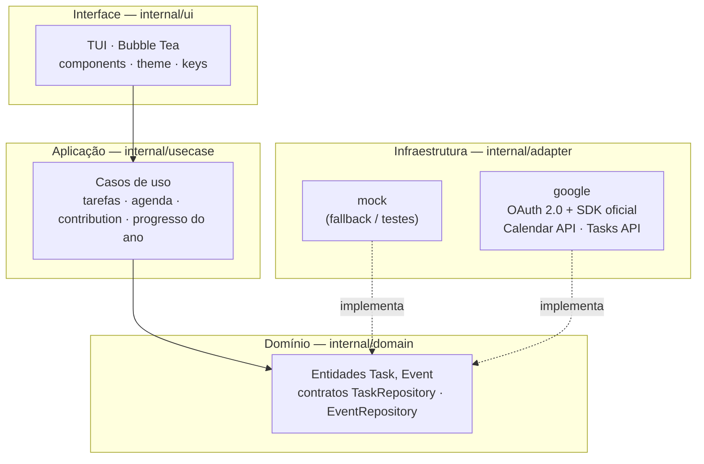

<div align="center">


### Painel de produtividade no terminal — tarefas, agenda e métricas


</div>

---

## 📖 Sobre

**Tocli** é um dashboard pessoal no terminal que agrupa **Google Tasks** (lista de tarefas), **Google Calendar** (agenda do dia) e **métricas visuais** estilo GitHub e barra de progresso do ano. A interface é totalmente orientada a teclado, com tema escuro e layout em painéis.

A integração com o Google usa o **SDK oficial** (`google.golang.org/api`) com **OAuth 2.0** — sem dependências externas de CLI ou ferramentas de terceiros. No estado atual, o projeto inclui um **adaptador mock** para rodar e explorar a TUI sem credenciais.

## Principais funcionalidades

| Funcionalidade | Descrição |
|----------------|-----------|
| **Lista de tarefas** | Painel esquerdo com tarefas abertas e concluídas recentes; conclusão com `Enter` / `Espaço`. Sincroniza com Google Tasks. |
| **Agenda do dia** | Eventos de hoje com horário, título e local; destaque para o que está em andamento. Lidos do Google Calendar. |
| **Contribution graph** | Grade anual de tarefas concluídas por dia, com intensidade de cor proporcional ao volume. |
| **Progresso do ano** | Percentual do ano decorrido, dias restantes e barra visual. |
| **TUI moderna** | [Bubble Tea](https://github.com/charmbracelet/bubbletea) + [Lipgloss](https://github.com/charmbracelet/lipgloss), navegação estilo vim (`hjkl` / setas) e atalhos inspirados em LazyGit / GitHub CLI. |

## Pré-requisitos

- **Go 1.22+** instalado ([go.dev/dl](https://go.dev/dl/)).
- Terminal com **suporte a cores** e, de preferência, **largura ≥ 100 colunas** para o layout em painéis.

## Instalação

```bash
git clone https://github.com/TETEURYAN/tocli.git
cd tocli
go mod download
```

## Uso rápido (modo demo)

Rode sem nenhuma configuração para explorar a TUI com dados fictícios:

```bash
go run .
# ou
go build -o tocli . && ./tocli -offline
```

## Uso com Google (modo produção)

### Para usuários finais

Se você recebeu um binário pré-compilado com as credenciais embutidas, **nenhuma configuração é necessária**. Basta rodar:

```bash
./tocli
```

Na **primeira execução**:
1. O terminal exibe um banner e **abre o browser automaticamente**.
2. O browser mostra a tela de consentimento do Google.
3. Você aprova o acesso ao Calendar (leitura) e Tasks (leitura e escrita).
4. O browser mostra uma página de confirmação — pode fechar e voltar ao terminal.
5. A TUI inicia com seus dados reais.

Nas execuções seguintes o login é silencioso — o token é renovado automaticamente.

### Para desenvolvedores

Você precisa criar credenciais OAuth no Google Cloud Console e compilar o binário com elas embutidas via `-ldflags`:

```bash
go build \
  -ldflags "-X 'tocli/internal/adapter/google.clientID=SEU_CLIENT_ID' \
            -X 'tocli/internal/adapter/google.clientSecret=SEU_CLIENT_SECRET'" \
  -o tocli .
```

Veja o guia completo em **[docs/GOOGLE.md](docs/GOOGLE.md)**.

### Flags disponíveis

| Flag | Descrição |
|------|-----------|
| `-offline` | Usa dados mock, sem chamar APIs do Google |
| `-sync` | Testa a autenticação Google e sai (sem TUI) |

## Atalhos de teclado

### Tarefas (painel esquerdo)

| Ação | Teclas |
|------|--------|
| Mover na lista | `↑` `↓` ou `k` `j` |
| Marcar como concluída / reabrir | `Enter` ou `Espaço` |
| Nova tarefa | `n` |
| Trocar lista (ao criar) | `[` `]` |
| Atualizar dados do Google | `r` |

### Agenda (direita, topo)

| Ação | Teclas |
|------|--------|
| Focar o painel | `Tab` / `Shift+Tab` |
| Mover entre eventos | `↑` `↓` ou `k` `j` |

### Globais

| Tecla | Função |
|-------|--------|
| `Tab` | Próximo painel |
| `Shift+Tab` | Painel anterior |
| `r` | Refresh (tarefas, eventos, gráfico) |
| `?` | Ajuda |
| `q` / `Ctrl+C` | Sair |

## Arquitetura



- **Domain** (`internal/domain`): entidades `Task`, `Event` e interfaces de repositório.
- **Use cases** (`internal/usecase`): listar tarefas, eventos de hoje, gerar contribution graph, calcular progresso do ano.
- **Adapters** (`internal/adapter`): `mock` para desenvolvimento/offline; `google` para integração real via SDK.
- **UI** (`internal/ui`): modelo Bubble Tea, componentes em `internal/ui/components`, tema em `internal/ui/theme`.

## Contribuindo

Contribuições são bem-vindas: issues e pull requests.

## Referências

- [Bubble Tea](https://github.com/charmbracelet/bubbletea)
- [Lipgloss](https://github.com/charmbracelet/lipgloss)
- [Bubbles](https://github.com/charmbracelet/bubbles)
- [Google API Go Client](https://github.com/googleapis/google-api-go-client)
- Inspiração visual: [Calcure](https://github.com/anufrievroman/calcure), contribution graphs estilo GitHub

## 📄 Licença

[MIT](LICENSE)
