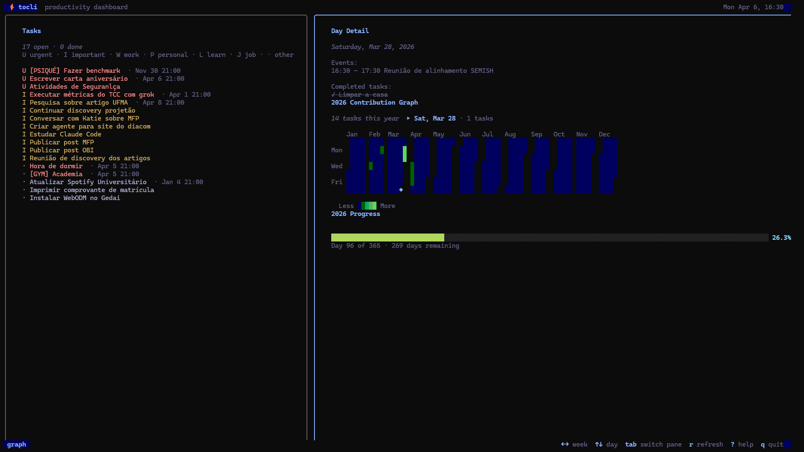
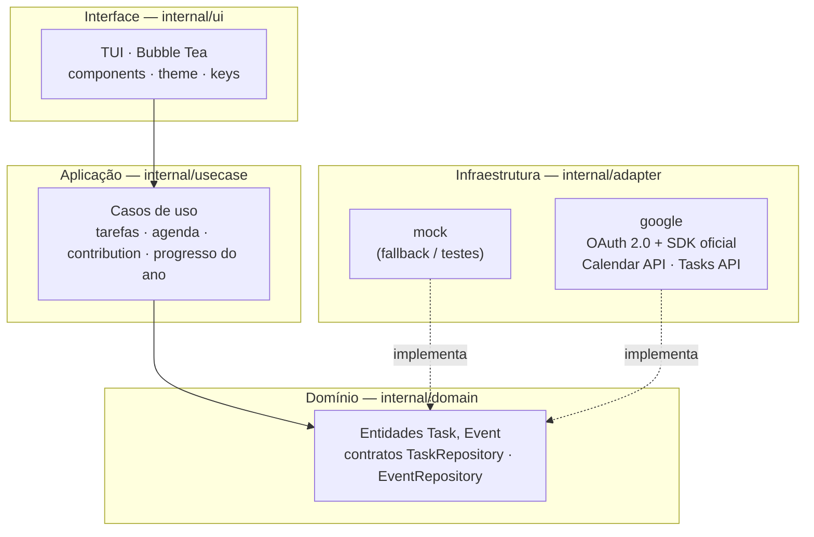

<div align="center">


### Painel de produtividade no terminal — tarefas, agenda e métricas


</div>

---

## Sobre

**Tocli** é um painel pessoal no terminal que reúne **Google Tasks**, **Google Calendar** e **métricas visuais** (contribution graph e progresso do ano). Interface totalmente por teclado, tema escuro, layout em painéis.

A integração com o Google usa o **SDK oficial** com **OAuth 2.0**, sem ferramentas de terceiros. Há um **modo offline** com dados fictícios para explorar a TUI sem credenciais.



---

## Funcionalidades

| | Funcionalidade | Descrição |
|---|---|---|
| ✅ | **Lista de tarefas** | Tarefas abertas e concluídas de hoje; suporta criar, concluir, reabrir e excluir. Sincroniza com Google Tasks. |
| 📅 | **Agenda do dia** | Eventos de hoje com horário, título e local. Destaque para o evento em andamento e esmaecimento dos passados. |
| 🗓️ | **Detalhe por dia** | Navegar pelo contribution graph mostra os eventos e tarefas concluídas daquele dia na agenda. |
| 📊 | **Contribution graph** | Grade anual de tarefas concluídas por dia, com intensidade de cor proporcional ao volume — estilo GitHub. |
| 📈 | **Progresso do ano** | Percentual do ano decorrido, dia atual e dias restantes. |
| 🔴 | **Prioridade** | Sistema de três níveis (Urgente / Importante / Normal) inferido automaticamente pelo nome da lista ou por prefixo no título da tarefa. |

---

## Pré-requisitos

- **Go 1.22+** ([go.dev/dl](https://go.dev/dl/))
- Terminal com suporte a cores e largura **≥ 100 colunas** recomendada (abaixo de 68 o layout muda para pilha vertical)

---

## Instalação

```bash
git clone https://github.com/TETEURYAN/tocli.git
cd tocli
go mod download
```

---

## Uso

### Modo demo (sem Google)

Explora a TUI com dados fictícios, sem nenhuma configuração:

```bash
go run .
# ou
go build -o tocli . && ./tocli -offline
```

### Modo produção (com Google)

Se você recebeu um binário pré-compilado com as credenciais embutidas, apenas execute:

```bash
./tocli
```

Na **primeira execução** o browser abre automaticamente para autenticação OAuth. Após aprovar, volte ao terminal — o token é salvo e renovado automaticamente nas execuções seguintes.

### Para desenvolvedores

Compile embutindo suas credenciais OAuth do Google Cloud Console:

```bash
go build \
  -ldflags "-X 'tocli/internal/adapter/google.clientID=SEU_CLIENT_ID' \
            -X 'tocli/internal/adapter/google.clientSecret=SEU_CLIENT_SECRET'" \
  -o tocli .
```

Guia completo: **[docs/GOOGLE.md](docs/GOOGLE.md)**

---

## Flags

| Flag | Descrição |
|------|-----------|
| `-offline` | Usa dados mock, sem chamar APIs do Google |
| `-sync` | Valida a conexão com o Google e sai (sem TUI) |
| `-version` | Exibe a versão atual e compara com a última release no GitHub |
| `-update` | Baixa a tag mais recente e recompila o binário automaticamente |

---

## Atalhos de teclado

### Globais

| Tecla | Ação |
|-------|------|
| `Tab` / `Shift+Tab` | Próximo / painel anterior |
| `r` | Atualizar tarefas, eventos e gráfico |
| `?` | Exibir / ocultar ajuda |
| `q` / `Ctrl+C` | Sair |

### Painel de tarefas

| Tecla | Ação |
|-------|------|
| `↑` `↓` ou `k` `j` | Navegar na lista |
| `Enter` ou `Espaço` | Concluir / reabrir tarefa selecionada |
| `n` | Criar nova tarefa |
| `d` → `y` | Excluir tarefa selecionada (pede confirmação; `n` ou `Esc` cancela) |

### Criando uma tarefa (`n`)

| Tecla | Ação |
|-------|------|
| `Tab` | Alternar foco entre campo **título** e campo **prazo** |
| `[` `]` | Lista de destino anterior / próxima |
| `Enter` | Confirmar e criar |
| `Esc` | Cancelar |

O campo de prazo aceita os formatos `DD-MM-YYYY` ou `DD-MM-YYYY HH:MM` (fuso local).

### Painel de agenda

| Tecla | Ação |
|-------|------|
| `↑` `↓` ou `k` `j` | Navegar entre eventos |

### Painel de contribution graph

| Tecla | Ação |
|-------|------|
| `←` `→` ou `h` `l` | Navegar semana a semana |
| `↑` `↓` ou `k` `j` | Navegar dia a dia |

Enquanto o cursor está sobre um dia no gráfico, a **agenda exibe os eventos e tarefas concluídas daquele dia** (não o dia atual).

---

## Sistema de prioridade

O Google Tasks não tem campo de prioridade nativo. O Tocli infere três níveis:

| Nível | Marcador | Como definir |
|-------|----------|--------------|
| **Urgente** | `🔴` vermelho | Prefixe o título com `[U]` ou `🔴` |
| **Importante** | `⭐` amarelo | Prefixe o título com `[I]`, `⭐` ou `★` |
| **Normal** | marcador de categoria | Nenhum prefixo necessário |

Se nenhum prefixo for usado, o nível é inferido a partir do **nome da lista** por palavras-chave (ex.: `urgente`, `asap`, `critical` → Urgente; `priority`, `focus`, `star` → Importante).

### Categorias de lista

Quando a prioridade é Normal, a tarefa exibe um marcador de categoria baseado no nome da lista:

| Marcador | Categoria | Exemplos de nome de lista |
|----------|-----------|--------------------------|
| `W` | Trabalho | `work`, `trabalho`, `job` |
| `J` | Job | `job`, `freelance` |
| `P` | Pessoal | `personal`, `pessoal`, `life` |
| `L` | Aprendizado | `learning`, `study`, `curso` |
| `·` | Padrão | qualquer outro nome |

---

## Arquitetura



- **Domain** (`internal/domain`): entidades `Task`, `Event` e interfaces de repositório.
- **Use cases** (`internal/usecase`): listar tarefas, eventos do dia, contribution graph, progresso do ano.
- **Adapters** (`internal/adapter`): `mock` para desenvolvimento/offline; `google` para integração real via SDK.
- **UI** (`internal/ui`): modelo Bubble Tea, componentes em `internal/ui/components`, tema em `internal/ui/theme`.

> Nenhum banco de dados local é criado. Os dados de tarefas e eventos vivem no Google (ou na memória em modo mock). Apenas o **token OAuth** é salvo em disco (`~/.config/tocli/token.json`).

---

## Contribuindo

Contribuições são bem-vindas via issues e pull requests.

## Referências

- [Bubble Tea](https://github.com/charmbracelet/bubbletea)
- [Lipgloss](https://github.com/charmbracelet/lipgloss)
- [Bubbles](https://github.com/charmbracelet/bubbles)
- [Google API Go Client](https://github.com/googleapis/google-api-go-client)
- Inspiração visual: [Calcure](https://github.com/anufrievroman/calcure), contribution graphs estilo GitHub

## Licença

[MIT](LICENSE)
