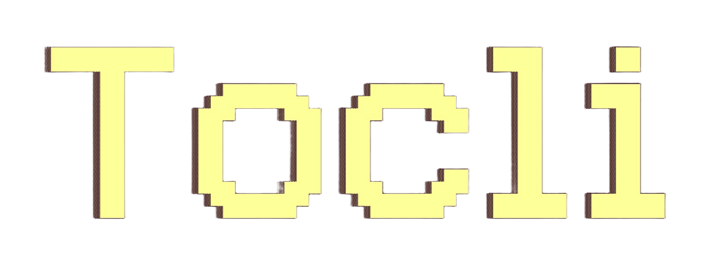

<div align="center">



### Painel de produtividade no terminal — tarefas, agenda e métricas


</div>

---

## Sobre

O **Tocli** reúne **Google Tasks**, **Google Calendar** e métricas de produtividade (contribution graph, avaliação diária e progresso do ano) em um único painel de terminal. A interface é operada pelo teclado, com suporte a mouse, e a integração com o Google usa o SDK oficial com OAuth 2.0.


---

## Funcionalidades

- **Tarefas:** listar, criar, editar, concluir, reabrir e excluir, com sincronização com o Google Tasks e prioridade inferida automaticamente ([detalhes](docs/PRIORITY.md)).
- **Agenda:** eventos do dia com horário e local, destaque para o evento em andamento e painel de detalhes com descrição e links (incluindo a videochamada).
- **Busca e comandos:** uma barra de busca de eventos que vai para o centro da tela ao ser ativada. Com o prefixo `>`, ela executa ações do aplicativo pelo nome.
- **Contribution graph:** grade anual de tarefas concluídas por dia, com navegação entre anos.
- **Avaliação diária:** nota de 1 a 5 e anotação por dia, salvas localmente e exportáveis em CSV.
- **Progresso do ano:** percentual decorrido, dia atual e dias restantes.
- **Temas:** escuro e claro, com detecção automática do fundo do terminal.

---

## Requisitos

- Go 1.24.2 ou superior ([go.dev/dl](https://go.dev/dl/)).
- Terminal com suporte a cores. Recomenda-se largura de 100 colunas ou mais; abaixo de 68 colunas os painéis são empilhados.
- Para o modo com Google: `git` e `go` no `PATH` (o `-update` compila a partir do código-fonte).

---

## Início rápido

O modo `-offline` usa dados de exemplo e não exige credenciais:

```bash
git clone https://github.com/TETEURYAN/tocli.git
cd tocli
go run . -offline
```

Para gerar o binário:

```bash
go build -o tocli .
./tocli -offline
```

---

## Uso com o Google

O Tocli lê as credenciais OAuth de duas formas:

1. **Embutidas no binário**, em tempo de compilação (recomendado para uso diário):

   ```bash
   go build \
     -ldflags "-X 'tocli/internal/adapter/google.clientID=SEU_CLIENT_ID' \
               -X 'tocli/internal/adapter/google.clientSecret=SEU_CLIENT_SECRET'" \
     -o tocli .
   ```

2. **Arquivo local**, para desenvolvimento: `~/.config/tocli/credentials.json` (ou o caminho em `TOC_GOOGLE_CREDENTIALS`).

Na primeira execução o navegador abre para a autenticação. O token é salvo em `~/.config/tocli/token.json` e renovado automaticamente. O passo a passo da configuração no Google Cloud Console está em **[docs/GOOGLE.md](docs/GOOGLE.md)**.

---

## Linha de comando

| Flag | Descrição |
|------|-----------|
| `-offline` | Usa dados de exemplo, sem chamar as APIs do Google. |
| `-sync` | Valida a conexão com o Google e encerra, sem abrir a interface. |
| `-theme auto\|dark\|light` | Tema de cores. O padrão `auto` segue o fundo do terminal. |
| `-version` | Exibe a versão, o commit de origem do binário e se há versão mais nova. |
| `-update` | Compila a release mais recente e substitui o executável em uso. |

O funcionamento do `-update` e as variáveis de ambiente estão em **[docs/CLI.md](docs/CLI.md)**.

---

## Atalhos essenciais

| Tecla | Ação |
|-------|------|
| `Tab` / `Shift+Tab` | Alternar entre os painéis |
| `/` | Buscar eventos (digite `>` para listar comandos) |
| `:` | Abrir a paleta de comandos |
| `n` / `e` / `d` | Criar / editar / excluir tarefa (painel de tarefas) |
| `Enter` | Concluir tarefa (tarefas) ou abrir detalhes do evento (agenda) |
| `[` / `]` | Ano anterior / seguinte (painel do gráfico) |
| `g` | Alternar entre contribution graph e avaliação diária |
| `r` | Atualizar os dados |
| `?` | Ajuda |
| `q` | Sair |

A lista completa, com os atalhos de cada painel, a busca, os comandos e o mouse, está em **[docs/USAGE.md](docs/USAGE.md)**.

---

## Documentação

| Documento | Conteúdo |
|-----------|----------|
| [docs/USAGE.md](docs/USAGE.md) | Atalhos de teclado e mouse, busca, paleta de comandos, tarefas, agenda e gráficos. |
| [docs/CLI.md](docs/CLI.md) | Flags, atualização do binário e variáveis de ambiente. |
| [docs/GOOGLE.md](docs/GOOGLE.md) | Configuração do OAuth no Google Cloud Console. |
| [docs/PRIORITY.md](docs/PRIORITY.md) | Como a prioridade e a categoria das tarefas são definidas. |
| [docs/ARCHITECTURE.md](docs/ARCHITECTURE.md) | Camadas, pacotes, interface e testes. |
| [docs/VERSIONING.md](docs/VERSIONING.md) | Política de versões, tags e releases. |
| [CHANGELOG.md](CHANGELOG.md) | Histórico de mudanças. |

---

## Contribuindo

1. Abra uma issue descrevendo o bug ou a proposta antes de um PR grande, para alinhar o escopo.
2. Trabalhe em uma branch por mudança (`feat/...`, `fix/...`) e abra o PR com o título no formato `TUI-NN: descrição`.
3. Antes de enviar, execute `go build ./...`, `go vet ./...` e `go test ./...`.
4. Novas versões seguem [docs/VERSIONING.md](docs/VERSIONING.md) e são registradas no [CHANGELOG.md](CHANGELOG.md).

---

## Suporte

Para relatar um problema ou tirar uma dúvida, abra uma [issue no GitHub](https://github.com/TETEURYAN/tocli/issues).

---

## Referências

- [Bubble Tea](https://github.com/charmbracelet/bubbletea), [Lip Gloss](https://github.com/charmbracelet/lipgloss) e [Bubbles](https://github.com/charmbracelet/bubbles) (Charm v2)
- [BubbleZone](https://github.com/lrstanley/bubblezone)
- [Google API Go Client](https://github.com/googleapis/google-api-go-client)
- Inspiração visual: [Calcure](https://github.com/anufrievroman/calcure) e os contribution graphs do GitHub

## Licença

[MIT](LICENSE)
