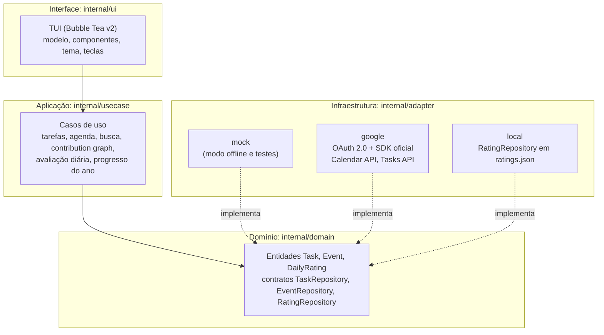

# Arquitetura

O Tocli segue uma organização em camadas, com as dependências sempre apontando para o domínio:



| Pacote | Responsabilidade |
|--------|------------------|
| `internal/domain` | Entidades (`Task`, `Event`, `DailyRating`), regras de prioridade e interfaces de repositório. |
| `internal/usecase` | Lógica de aplicação: tarefas, eventos, busca (`EventIndex`), contribution graph, avaliação diária (com exportação CSV) e progresso do ano. |
| `internal/adapter/google` | Repositórios sobre o Google Tasks e o Google Calendar, com OAuth 2.0. |
| `internal/adapter/mock` | Repositórios em memória para `-offline` e para testes. |
| `internal/adapter/local` | Persistência local das avaliações diárias. |
| `internal/platform` | Integração com o sistema operacional (abrir links no navegador, incluindo WSL). |
| `internal/ui` | Interface Bubble Tea. |

O `main.go` é a raiz de composição: escolhe os repositórios, monta os casos de uso e entrega tudo a `ui.NewModel`. Os casos de uso dependem apenas das interfaces do domínio. Uma nova fonte de dados entra implementando `TaskRepository` ou `EventRepository` em um novo pacote de adapter.

## Dados e armazenamento

Não há banco de dados. Tarefas e eventos ficam no Google (ou em memória no modo `-offline`). Em `~/.config/tocli/` ficam o token OAuth (`token.json`, permissão 0600) e as avaliações diárias (`ratings.json`). O calendário é acessado apenas para leitura (escopo `calendar.readonly`); as tarefas usam o escopo completo de leitura e escrita.

## Interface

A interface usa Bubble Tea, Lip Gloss e Bubbles na versão 2 (módulos `charm.land/...`) e BubbleZone para o mouse. Isso exige Go 1.24.2 ou superior.

| Arquivo | Conteúdo |
|---------|----------|
| `model.go` | `Model`, mensagens e o modo de interação (`mode`): dashboard ou exatamente um diálogo por vez. |
| `update.go` | `Update`, teclas do dashboard, mouse e foco. |
| `view.go`, `statusbar.go` | Renderização, cartões, cabeçalho e barras de status. |
| `layout.go` | `computeLayout`, função pura que calcula o tamanho de cada painel a partir do terminal. |
| `modals.go` | Formulários de tarefa e anotação, ajuda e confirmação, desenhados sobre o dashboard. |
| `search.go`, `palette.go` | Busca de eventos e paleta de comandos, com a animação da barra. |
| `eventdetail.go` | Painel de detalhes do evento e abertura de links. |
| `commands.go` | Todos os `tea.Cmd` que fazem I/O. Não há I/O em `View` nem nos tratadores de tecla. |
| `keys.go` | Mapa de teclas. |
| `components/` | Lista de tarefas, agenda, gráfico e barra de progresso. |
| `theme/` | Paletas escura e clara. |

Decisões que valem conhecer:

- **Um modo por vez.** Diálogos são mutuamente exclusivos e ficam centralizados em `Model.mode`.
- **Layout testável.** `computeLayout` é pura e coberta por teste de todos os tamanhos de 10x1 a 220x90: os painéis sempre somam exatamente o espaço disponível.
- **Tema como dado.** Não há tema global. A paleta viaja em `Styles.T` e pode ser trocada em execução.
- **Busca em memória.** Os eventos são carregados uma vez por abertura e filtrados localmente, de forma instantânea.
- **Respostas atrasadas são descartadas.** Trocas rápidas de ano não deixam dados de um ano antigo sobrescreverem o atual.

## Testes

```bash
go build ./...
go vet ./...
go test ./...
```

Os testes ficam ao lado do código. Cobrem o layout em todos os tamanhos, os modos de interação, a busca e a paleta de comandos, a edição de tarefas, a navegação entre anos, os detalhes do evento, o tema, a conversão de datas do Google em vários fusos horários e o `-update` de ponta a ponta (com um repositório de duas releases em que o comportamento muda, e não só o número da versão).
