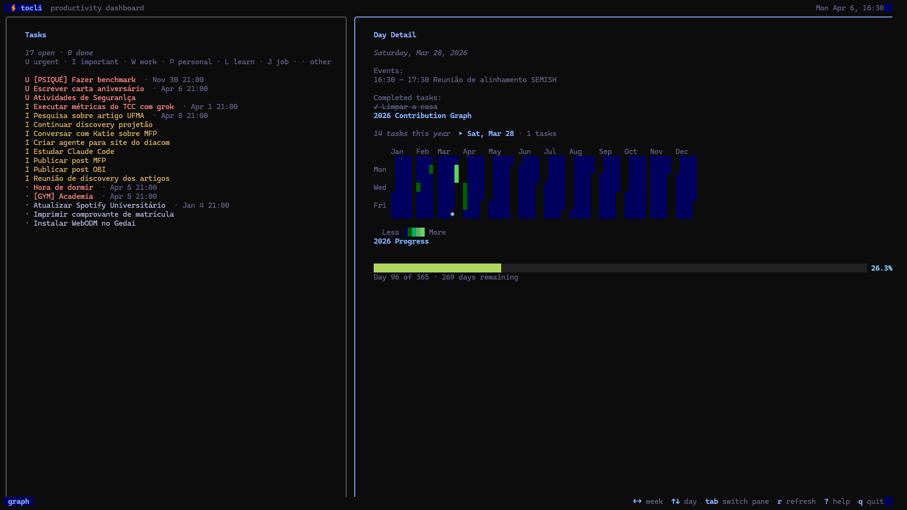

# Pré-visualização



Para ver o Tocli em funcionamento sem conta Google, use os dados de exemplo:

```bash
go run . -offline
```

Os painéis são tarefas (esquerda), agenda, contribution graph e progresso do ano (direita). Abaixo de 68 colunas eles são empilhados na vertical. Os atalhos estão em [USAGE.md](USAGE.md).
