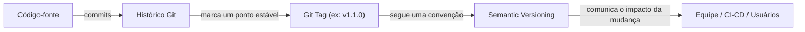
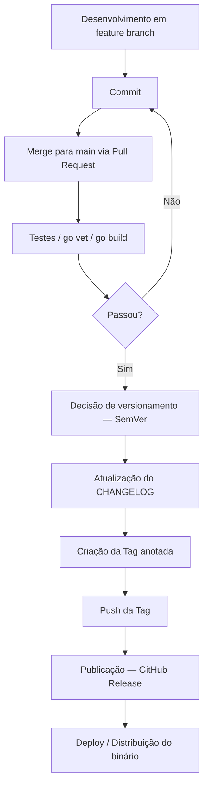
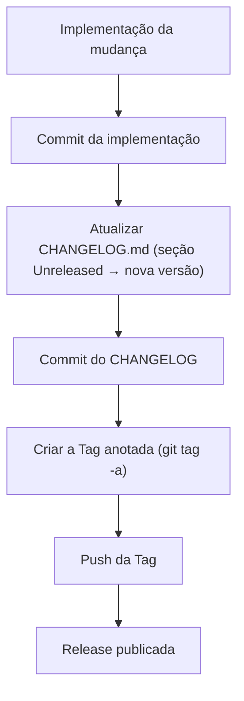
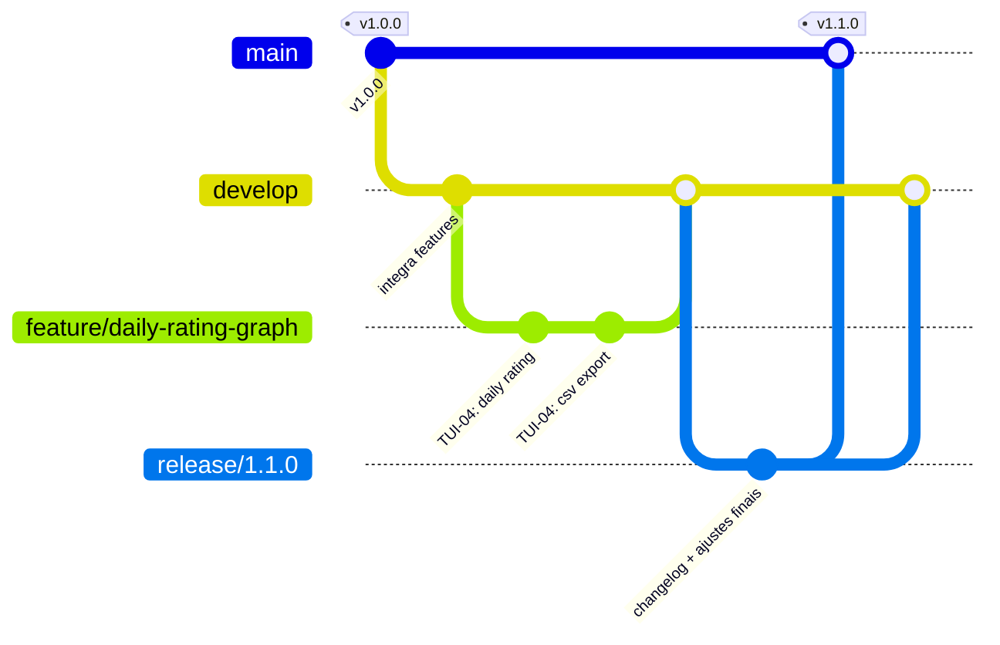
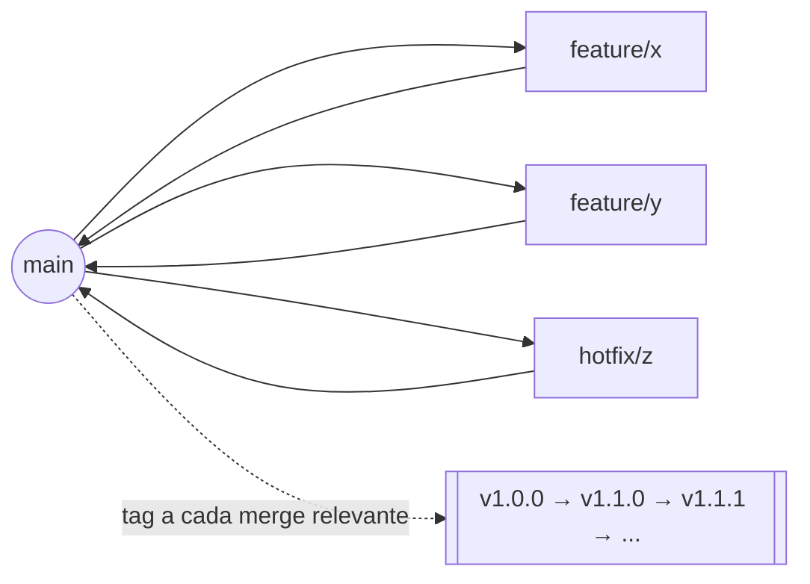

# Guia de Versionamento do Tocli

Este documento é o guia oficial de versionamento do projeto **Tocli**. Ele explica os conceitos fundamentais de versionamento de software, o padrão **Semantic Versioning (SemVer)**, como usar **Git Tags**, como manter um **CHANGELOG**, e qual fluxo de branches o projeto deve seguir a partir de agora.

> **Contexto que motivou este guia:** o Tocli está atualmente na tag `v1.0.0` (a "primeira versão oficial", criada em 2026-04-06). Antes disso, o projeto usou apenas duas tags — `v0.2.0-alpha` e `v0.5.6-rc-1` — sem um critério documentado sobre quando incrementar cada número. Com a branch `feat/daily-rating-graph` prestes a ser mesclada em `main` (adicionando o modo *Daily Rating Graph*, notas de texto por dia e exportação CSV), é preciso decidir qual será a **próxima versão** — e todas as futuras. Este documento resolve essa dúvida de forma permanente e serve de referência para qualquer decisão de versionamento daqui em diante.

## Sumário

1. [Introdução](#1-introdução)
2. [Conceitos fundamentais](#2-conceitos-fundamentais)
3. [Semantic Versioning (SemVer)](#3-semantic-versioning-semver)
4. [Pré-releases](#4-pré-releases)
5. [Git Tags](#5-git-tags)
6. [Fluxo de releases](#6-fluxo-de-releases)
7. [CHANGELOG](#7-changelog)
8. [Relação entre Tag e CHANGELOG](#8-relação-entre-tag-e-changelog)
9. [Fluxo Git recomendado](#9-fluxo-git-recomendado)
10. [Exemplos completos](#10-exemplos-completos)
11. [Boas práticas](#11-boas-práticas)
12. [Erros comuns (encontrados no próprio histórico do Tocli)](#12-erros-comuns-encontrados-no-próprio-histórico-do-tocli)
13. [Conclusão e próxima versão](#13-conclusão-e-próxima-versão)

---

## 1. Introdução

### O que é versionamento de software

Versionamento de software é a prática de atribuir **identificadores únicos e ordenáveis** (versões) a estados específicos de um projeto ao longo do tempo. Cada versão representa uma "fotografia" do código em um ponto em que ele foi considerado estável o suficiente para ser usado, distribuído ou publicado.

Sem versionamento, frases como "atualiza pra última versão" ou "esse bug já foi corrigido" não têm significado verificável — não há como saber *qual* código está rodando em produção, nem *o que* mudou entre duas execuções do programa.

### Por que versionar um projeto

- **Comunicação**: uma versão comunica, por si só, o tamanho e a natureza de uma mudança (uma correção pequena não deveria "parecer" tão arriscada quanto uma reescrita de API).
- **Compatibilidade**: consumidores de uma biblioteca ou API precisam saber se podem atualizar sem quebrar o que já usam.
- **Reprodutibilidade**: qualquer bug, comportamento ou build deve poder ser associado a uma versão exata do código.
- **Coordenação**: em equipes, versões servem como pontos de sincronização — "o que está na v1.1.0" é uma pergunta com resposta objetiva.

### Benefícios por área

| Área | Benefício concreto |
|---|---|
| **Equipes** | Todo mundo sabe exatamente o que está em cada ambiente (dev, staging, produção) e o que falta para a próxima entrega. |
| **CI/CD** | Pipelines podem automatizar build, teste e publicação de artefatos a partir de uma tag, sem intervenção manual. |
| **Rastreabilidade** | Um bug relatado por um usuário pode ser mapeado para uma versão exata → um commit exato → uma tag exata. |
| **Manutenção** | Facilita saber se um bug já foi corrigido em uma versão mais nova, ou se uma versão antiga ainda precisa de um *hotfix*. |

### Relação entre Git e Versionamento

Git é a ferramenta; versionamento é a **disciplina**. Git por si só não impõe nenhuma convenção de versão — ele fornece os mecanismos (**tags**, **branches**, **histórico imutável de commits**) sobre os quais uma convenção de versionamento (como o SemVer) é construída.



No caso do Tocli, o repositório já usa Git normalmente (branches como `feat/daily-rating-graph`, Pull Requests, tags como `v1.0.0`) — o que faltava era a **convenção** de quando e como essas tags devem avançar. É exatamente isso que este guia formaliza.

---

## 2. Conceitos Fundamentais

| Conceito | Definição | Exemplo no Tocli |
|---|---|---|
| **Repositório** | O projeto completo, com todo o seu histórico de mudanças, armazenado pelo Git. | `github.com/TETEURYAN/tocli` |
| **Commit** | Um snapshot atômico e imutável de mudanças, com uma mensagem descritiva. | `5f1fea3 TUI-04: Add Daily Rating Graph mode to Graph Pane` |
| **Branch** | Uma linha de desenvolvimento independente, permitindo trabalhar em paralelo sem afetar `main`. | `feat/daily-rating-graph` |
| **Merge** | Une o histórico de uma branch a outra, incorporando suas mudanças. | Merge do PR #6 (`feat/daily-rating-graph`) em `main`. |
| **Rebase** | Reaplica os commits de uma branch sobre outro ponto do histórico, produzindo um histórico linear. | `git rebase main` antes de abrir um PR, para evitar merges desnecessários. |
| **Histórico** | A sequência completa e ordenada de commits de um repositório. | `git log --oneline` mostrando todos os commits desde `62f4067` até hoje. |
| **Release** | Uma versão do software formalmente publicada para uso — normalmente associada a uma tag e a artefatos (binários). | A GitHub Release `v1.0.0`, com o texto "First official version". |
| **Build** | O processo (e o resultado) de compilar o código-fonte em um artefato executável. | `go build -o tocli .` |
| **Artefato** | O resultado tangível de um build — o que de fato é distribuído/publicado. | O binário `tocli` (ou `tocli-linux-amd64`, se publicado por plataforma). |
| **Tag** | Um ponteiro nomeado e (idealmente) imutável para um commit específico, usado para marcar releases. | `v1.0.0` apontando para o commit `7614749`. |

---

## 3. Semantic Versioning (SemVer)

O Tocli segue o padrão [Semantic Versioning 2.0.0](https://semver.org/lang/pt-BR/), no formato:

```
MAJOR.MINOR.PATCH
```

Exemplo: em `1.4.7` → `MAJOR = 1`, `MINOR = 4`, `PATCH = 7`.

A regra central do SemVer é simples: **o número que você incrementa comunica o tipo de mudança que aconteceu**, e cada incremento **reseta os números à direita para zero**.

### MAJOR — quebra de compatibilidade

Incremente o `MAJOR` quando a mudança **quebra compatibilidade** com o comportamento anterior.

Exemplos aplicáveis ao Tocli:
- Remover ou renomear uma flag de CLI existente (ex.: remover `-offline`).
- Mudar a assinatura de uma interface de domínio como `domain.TaskRepository` ou `domain.RatingRepository`, quebrando qualquer adapter externo que a implemente.
- Mudar o formato de `~/.config/tocli/ratings.json` de forma que versões antigas não consigam mais ler o arquivo (sem migração automática).
- Mudar o comportamento padrão de um atalho de teclado já documentado.

### MINOR — novas funcionalidades compatíveis

Incremente o `MINOR` quando a mudança **adiciona funcionalidade de forma retrocompatível** — nada que já funcionava para de funcionar.

Exemplos aplicáveis ao Tocli:
- Adicionar o modo **Daily Rating Graph** ao `GraphPane` (tecla `g`) — funcionalidade nova, nada existente quebra.
- Adicionar a tecla `t` para notas de texto por dia.
- Adicionar a exportação de CSV (`e`).
- Adicionar uma nova flag de CLI opcional.

### PATCH — correções e ajustes internos

Incremente o `PATCH` para **correções de bugs e pequenos ajustes** que não mudam o comportamento esperado nem adicionam funcionalidade nova.

Exemplos aplicáveis ao Tocli:
- Corrigir os avisos de `go vet` em `internal/adapter/google/auth.go` (`fmt.Fprintln` com newline redundante).
- Ajustar a saturação das cores do gradiente do Daily Rating (`RatingLow`/`RatingHigh`) para ficarem mais fortes.
- Corrigir um `panic` ao navegar o gráfico em um terminal muito estreito.

### Versões 0.x — desenvolvimento inicial

Enquanto `MAJOR = 0` (ex.: `0.2.0-alpha`, `0.5.6-rc-1`), o SemVer considera o projeto em **desenvolvimento inicial**: a API pode mudar a qualquer momento, mesmo entre versões `MINOR`, sem que isso seja considerado uma quebra formal de compatibilidade. É o estágio em que o Tocli esteve até a tag `v1.0.0`.

### Beta, RC e versões estáveis

| Estágio | Significado | Estabilidade esperada |
|---|---|---|
| **Beta** (`-beta`) | Funcionalidades já estão presentes, mas ainda em teste ativo; bugs são esperados. | Baixa/média — não usar em produção. |
| **RC** — *Release Candidate* (`-rc.N`) | Candidata a se tornar a versão estável; só recebe correções, não novas funcionalidades. | Alta — usada para validação final antes do lançamento oficial. |
| **Estável** (sem sufixo) | Versão pronta para uso geral. | Máxima — é o que deve rodar em produção. |

---

## 4. Pré-releases

O SemVer permite identificadores de pré-release após um hífen:

```
1.0.0-alpha
1.0.0-beta
1.0.0-rc.1
```

Uma pré-release tem **precedência menor** que a versão final correspondente — ou seja, `1.0.0-rc.1 < 1.0.0`.

| Sufixo | Quando usar | Diferença principal |
|---|---|---|
| `-alpha` | Fase inicial, funcionalidades incompletas ou instáveis, uso interno apenas. | Pode mudar drasticamente a qualquer momento. |
| `-beta` | Funcionalidades completas, em teste com um grupo maior (interno ou usuários selecionados). | API já não deveria mudar, mas bugs ainda são esperados. |
| `-rc.1`, `-rc.2`, ... | Última validação antes do lançamento estável — o `.N` numera candidatas sucessivas se problemas forem encontrados. | Só recebe correções de bugs bloqueadores; nenhuma funcionalidade nova. |

No histórico real do Tocli, `v0.2.0-alpha` e `v0.5.6-rc-1` já seguiram essa ideia (uma fase inicial e uma candidata a release), embora com formatação de sufixo levemente diferente da recomendada pelo SemVer (`-rc-1` em vez de `-rc.1` — veja a seção [12](#12-erros-comuns-encontrados-no-próprio-histórico-do-tocli)).

---

## 5. Git Tags

### O que é uma Tag

Uma **tag** é um ponteiro nomeado para um commit específico. Diferente de uma branch, uma tag **não se move** — uma vez criada (e, idealmente, publicada), ela deve apontar para o mesmo commit para sempre.

### Tag vs. Branch vs. Commit vs. Release

| Conceito | Muda com o tempo? | Propósito |
|---|---|---|
| **Commit** | Não (imutável) | Unidade atômica de mudança. |
| **Branch** | Sim (ponteiro móvel) | Linha de desenvolvimento em andamento. |
| **Tag** | Não (deveria ser imutável) | Marca um commit específico como uma versão. |
| **Release** | Não | Conceito de mais alto nível: uma tag **mais** artefatos publicados **mais** notas de lançamento (ex.: uma GitHub Release). |

```mermaid
flowchart LR
    subgraph main["branch main (móvel)"]
        c1((commit)) --> c2((commit)) --> c3((commit)) --> c4((commit))
    end
    c3 -. tag v1.0.0 .-> t1[["v1.0.0"]]
    c4 -. tag v1.1.0 .-> t2[["v1.1.0"]]
```

### Lightweight, Annotated e Signed Tags

| Tipo | O que armazena | Quando usar |
|---|---|---|
| **Lightweight** | Apenas um ponteiro para o commit — sem autor, data ou mensagem próprios. | Marcações internas rápidas, nunca para releases publicadas. |
| **Annotated** | Um objeto Git completo: autor, data, mensagem e (opcionalmente) assinatura. `git show` exibe esses metadados. | **Toda release oficial** — é o padrão recomendado. |
| **Signed** | Uma annotated tag assinada criptograficamente (GPG), provando que veio de quem diz ter criado. | Projetos que precisam garantir autenticidade da release (ex.: software distribuído publicamente sem verificação por outro canal). |

> No histórico atual do Tocli, `v1.0.0` é uma **annotated tag** (mensagem: "First official version"), mas `v0.2.0-alpha` e `v0.5.6-rc-1` são **lightweight**. A partir de agora, **todas as tags devem ser annotated** — veja a seção [11](#11-boas-práticas).

### Comandos essenciais

```bash
# Listar tags existentes
git tag

# Criar uma annotated tag (recomendado para toda release)
git tag -a v1.1.0 -m "Daily Rating Graph, notas de dia e exportação CSV"

# Publicar as tags no remoto
git push origin --tags
# ou, para publicar uma tag específica:
git push origin v1.1.0

# Ver os metadados completos de uma tag
git show v1.1.0

# Apagar uma tag localmente
git tag -d v1.1.0

# Apagar uma tag no remoto (cuidado: só faça isso para corrigir um erro
# recém-cometido, nunca para "desfazer" uma release já divulgada)
git push origin --delete v1.1.0
```

### Boas práticas de tagging

- Use sempre `git tag -a` (annotated), nunca `git tag` sozinho, para releases.
- A mensagem da tag deve resumir o que a versão entrega — não deixe vazia.
- Crie a tag **depois** que o CHANGELOG estiver atualizado e commitado (seção [8](#8-relação-entre-tag-e-changelog)).
- Nunca apague ou recrie uma tag que já foi publicada e usada por alguém — trate-a como imutável.

---

## 6. Fluxo de Releases

O fluxo abaixo representa o caminho completo de uma mudança, desde o desenvolvimento até o deploy:



No contexto atual do Tocli, "Testes" corresponde a `go build ./...` e `go vet ./...` (não há suíte de testes automatizada — veja `CLAUDE.md`), além de verificação manual da TUI quando a mudança afeta a interface.

---

## 7. CHANGELOG

### O que é e por que existe

Um `CHANGELOG.md` é um arquivo, na raiz do repositório, que lista **de forma legível por humanos** o que mudou em cada versão publicada. Ele existe porque uma tag ou um número de versão, sozinhos, não explicam **o que** de fato mudou — o CHANGELOG é a "tradução" das mudanças técnicas (commits, PRs) em uma narrativa que qualquer usuário ou desenvolvedor consegue entender sem ler o diff completo.

> **Estado atual do Tocli**: o repositório ainda **não possui** um `CHANGELOG.md`. Nenhuma das três tags existentes (`v0.2.0-alpha`, `v0.5.6-rc-1`, `v1.0.0`) tem uma entrada correspondente. Recomendamos criar o arquivo já na próxima release (`v1.1.0`), com uma entrada retroativa resumindo `v1.0.0` para não perder o contexto histórico.

### Quem atualiza e quando

- **Quem**: quem abre o Pull Request que introduz a mudança é responsável por adicionar (ou atualizar) a entrada correspondente na seção `[Unreleased]` do CHANGELOG.
- **Quando**: no mesmo PR da mudança — nunca depois, e nunca só no momento de criar a tag (nesse ponto, `[Unreleased]` apenas é renomeada para o número da versão e a data).

### O padrão Keep a Changelog

O Tocli adota o formato [Keep a Changelog](https://keepachangelog.com/pt-BR/1.0.0/), que organiza cada versão em até cinco subseções fixas:

| Seção | Contém |
|---|---|
| `Added` | Funcionalidades novas. |
| `Changed` | Mudanças em comportamento já existente. |
| `Deprecated` | Funcionalidades que ainda funcionam, mas serão removidas em breve. |
| `Removed` | Funcionalidades removidas nesta versão. |
| `Fixed` | Correções de bugs. |
| `Security` | Correções relacionadas a vulnerabilidades. |

### Exemplo de estrutura

```markdown
# Changelog

Todas as mudanças notáveis deste projeto serão documentadas neste arquivo.

O formato segue [Keep a Changelog](https://keepachangelog.com/pt-BR/1.0.0/),
e este projeto adere ao [Semantic Versioning](https://semver.org/lang/pt-BR/).

## [Unreleased]

## [1.1.0] - 2026-07-10

### Added
- Modo Daily Rating Graph no painel de gráfico (`g` alterna entre modos).
- Nota de texto livre por dia (`t`), persistida junto com a avaliação.
- Exportação em CSV das notas do mês (`e`).

### Changed
- Cores do gradiente do Daily Rating tornadas mais saturadas para melhor leitura.

## [1.0.0] - 2026-04-06

### Added
- Primeira versão oficial do Tocli: tarefas, agenda, contribution graph e
  progresso do ano, com integração real ao Google e modo offline.
```

Cada seção responde a uma pergunta objetiva para quem está lendo:
- **Added** → "o que eu ganho de novo?"
- **Changed** → "o que já existia e agora se comporta diferente?"
- **Fixed** → "qual problema que eu talvez tenha sofrido foi resolvido?"
- **Removed** → "o que eu preciso parar de usar?"

---

## 8. Relação entre Tag e CHANGELOG

**Regra:** toda criação de tag deve, obrigatoriamente, ter uma entrada correspondente no CHANGELOG **já commitada antes** da tag ser criada.



### Por que essa ordem importa

Se a tag for criada **antes** do CHANGELOG ser atualizado, ela vai apontar para um commit em que o CHANGELOG ainda não descreve a própria versão que a tag representa — um leitor que faz `git show v1.1.0:CHANGELOG.md` veria uma versão do arquivo sem a entrada `[1.1.0]`, quebrando a rastreabilidade que o CHANGELOG deveria garantir.

Em outras palavras: **a tag é o carimbo de "isto está pronto"; o CHANGELOG é a explicação do que está pronto.** O carimbo só faz sentido depois que a explicação existe.

---

## 9. Fluxo Git recomendado

### O modelo clássico (Git Flow)

O modelo Git Flow completo usa cinco tipos de branch:

| Branch | Propósito |
|---|---|
| `main` | Sempre reflete a última versão **estável e publicada**. Todo commit em `main` corresponde a uma tag. |
| `develop` | Integração contínua de funcionalidades já finalizadas, aguardando a próxima release. |
| `feature/*` | Uma funcionalidade em desenvolvimento, criada a partir de `develop`. |
| `release/*` | Estabilização de uma versão antes do lançamento (só correções, sem novas funcionalidades). |
| `hotfix/*` | Correção urgente aplicada diretamente sobre `main`, para um bug em produção que não pode esperar o próximo ciclo. |



### O que o Tocli deve realmente adotar

O histórico real do Tocli (`git log --oneline`) mostra que o projeto **já opera** em um fluxo mais simples: branches de feature nomeadas (`feat/daily-rating-graph`, `feature/...`) saem diretamente de `main` e voltam para `main` via Pull Request, sem uma branch `develop` intermediária. Introduzir `develop` e `release/*` agora adicionaria processo sem necessidade real para o tamanho atual da equipe.

**Recomendação**: adotar uma variação enxuta ("trunk-based com feature branches"), mantendo apenas:

- `main` — sempre estável, sempre com tag em cada release.
- `feature/*` (ou o padrão de PR já usado, ex. `TUI-0N: <descrição>`) — uma branch por mudança, mesclada via PR.
- `hotfix/*` — reservado para correções urgentes direto sobre `main`, quando um bug crítico precisa de um PATCH imediato sem esperar a próxima feature terminar.



Se o projeto crescer (múltiplas versões em manutenção simultânea, equipe maior, releases agendadas), reavalie a adoção de `develop` e `release/*` nesse momento — não antes.

---

## 10. Exemplos completos

### Correção de bug (PATCH)

```
1.4.1 → 1.4.2
```

```bash
git checkout -b fix/graph-color-panic main
# ... corrige o bug ...
git commit -m "fix: corrige panic ao navegar o gráfico em terminal estreito"
git push origin fix/graph-color-panic
# PR revisado e mesclado em main
```

CHANGELOG:
```markdown
## [1.4.2] - 2026-08-01
### Fixed
- Corrigido panic ao navegar o Contribution Graph em terminais com menos de 40 colunas.
```

Tag:
```bash
git checkout main && git pull
git tag -a v1.4.2 -m "Corrige panic no Contribution Graph em terminais estreitos"
git push origin v1.4.2
```

### Nova funcionalidade (MINOR)

```
1.4.2 → 1.5.0
```

Este é exatamente o caso da branch `feat/daily-rating-graph` sendo mesclada em `main` — veja a aplicação real na seção [13](#13-conclusão-e-próxima-versão).

```bash
git checkout -b feat/daily-rating-graph main
git commit -m "TUI-04: Add Daily Rating Graph mode to Graph Pane"
git commit -m "TUI-04: Add CSV export for the Daily Rating Graph"
git commit -m "TUI-04: Add free-text day notes to the Daily Rating Graph"
git push origin feat/daily-rating-graph
# PR #6 revisado e mesclado em main
```

CHANGELOG:
```markdown
## [1.5.0] - 2026-08-15
### Added
- Modo Daily Rating Graph (`g`), com nota de 1-5 por dia.
- Nota de texto por dia (`t`).
- Exportação mensal em CSV (`e`).
```

Tag:
```bash
git checkout main && git pull
git tag -a v1.5.0 -m "Daily Rating Graph, notas de dia e exportação CSV"
git push origin v1.5.0
```

### Mudança incompatível (MAJOR)

```
1.5.0 → 2.0.0
```

Exemplo hipotético: renomear a flag `-offline` para `-demo`, quebrando qualquer script que dependa do nome antigo.

```bash
git checkout -b breaking/rename-offline-flag main
git commit -m "breaking: renomeia flag -offline para -demo"
git push origin breaking/rename-offline-flag
# PR revisado e mesclado em main, com destaque na descrição do PR
# para o breaking change
```

CHANGELOG:
```markdown
## [2.0.0] - 2026-09-01
### Changed
- **BREAKING:** a flag `-offline` foi renomeada para `-demo`. Scripts e
  automações que usam `-offline` precisam ser atualizados.
```

Tag:
```bash
git checkout main && git pull
git tag -a v2.0.0 -m "BREAKING: renomeia -offline para -demo"
git push origin v2.0.0
```

---

## 11. Boas práticas

- **Nunca altere uma tag já publicada.** Se um erro for encontrado depois do push, publique uma nova versão corrigida (ex.: `v1.1.1`), nunca reescreva `v1.1.0`.
- **Nunca reutilize um número de versão**, mesmo que uma tag tenha sido apagada por engano.
- **Toda release deve ter tag — e toda tag deve ter uma entrada de CHANGELOG.** Uma sem a outra quebra a rastreabilidade.
- **Evite commits diretos em `main`** fora de hotfixes emergenciais — prefira sempre passar por Pull Request, mesmo em mudanças pequenas.
- **Use mensagens de commit claras**, seguindo o padrão já usado no projeto (`TUI-0N: <descrição>` para features de UI, ou prefixos como `fix:`/`docs:`/`breaking:` para o restante).
- **Automatize a geração de releases quando possível** (ex.: uma GitHub Action que, ao detectar uma nova tag `v*`, publica automaticamente a GitHub Release com o trecho correspondente do CHANGELOG).
- **Revise a mudança antes de criar a tag** — `go build ./...` e `go vet ./...` devem passar limpos (veja `CLAUDE.md`), e o comportamento na TUI deve ter sido verificado manualmente quando aplicável.
- **Mantenha o `Version` embutido no binário sincronizado com a tag.** Hoje `main.go` define `var Version = "v0.5.6-rc-1"` — desatualizado em relação à tag `v1.0.0`. Isso deve ser corrigido a cada release (veja o erro correspondente na próxima seção).
- **Padronize o tipo de tag**: sempre `git tag -a` (annotated), nunca lightweight, para manter autor/data/mensagem no histórico.

---

## 12. Erros comuns (encontrados no próprio histórico do Tocli)

Esta seção usa achados reais do repositório como estudo de caso — não são erros hipotéticos, mas o que uma auditoria de `git tag`, `git log` e `main.go` revelou hoje.

### Erro 1 — `Version` no código dessincronizado da tag

**O problema**: `main.go` define `var Version = "v0.5.6-rc-1"`, mas a tag mais recente é `v1.0.0`. O commit que criou a tag (`7614749 [DOCS]: Launch v1.0.0`) alterou apenas `README.md` e uma imagem — nunca tocou em `main.go`.

**O impacto**: a flag `-version` (que compara a versão embutida com a última release do GitHub via `getLatestTag()`) informa ao usuário que ele está em `v0.5.6-rc-1` e que há uma "nova versão disponível" (`v1.0.0`) — mesmo que o binário já **seja** a v1.0.0. A informação de versão do próprio programa está errada.

**Como evitar**: inclua a atualização de `Version` em `main.go` como parte do checklist de release (seção [6](#6-fluxo-de-releases)), no mesmo commit que atualiza o CHANGELOG — nunca como uma etapa separada e opcional.

### Erro 2 — Tags leves e anotadas misturadas

**O problema**: `v0.2.0-alpha` e `v0.5.6-rc-1` são *lightweight tags* (`git for-each-ref` mostra `objecttype: commit`); apenas `v1.0.0` é uma *annotated tag* de verdade.

**O impacto**: tags leves não guardam autor, data de criação da tag nem mensagem — `git show v0.5.6-rc-1` não conta a mesma história que `git show v1.0.0`. Isso torna o histórico de releases inconsistente e dificulta auditorias.

**Como evitar**: padronizar `git tag -a -m "..."` para toda tag a partir de agora (seção [11](#11-boas-práticas)).

### Erro 3 — Ausência de CHANGELOG

**O problema**: nenhuma das três tags existentes tem uma entrada correspondente em um `CHANGELOG.md` — porque o arquivo simplesmente não existe no repositório.

**O impacto**: para saber o que mudou entre `v0.2.0-alpha` e `v1.0.0`, a única fonte é reconstituir manualmente o `git log`, o que não escala e não é amigável para quem não é desenvolvedor do projeto.

**Como evitar**: criar `CHANGELOG.md` já na próxima release (`v1.1.0`), seguindo a seção [7](#7-changelog), e aplicar a regra da seção [8](#8-relação-entre-tag-e-changelog) daqui em diante.

### Erro 4 — Salto de versão sem critério documentado

**O problema**: o projeto foi de `v0.2.0-alpha` direto para `v0.5.6-rc-1` — um salto de `MINOR` (0.2 → 0.5) e `PATCH` (0 → 6) ao mesmo tempo, sem nenhum registro do que motivou pular de 0.3.0/0.4.0 diretamente para 0.5.6.

**O impacto**: sem um critério visível, fica impossível para alguém novo no projeto saber se o salto foi intencional (várias funcionalidades acumuladas) ou um erro de digitação na tag.

**Como evitar**: a partir de agora, cada incremento de versão deve corresponder a **uma decisão explícita** documentada no CHANGELOG (seção [7](#7-changelog)) — o número nunca deve "pular" sem que a entrada correspondente explique o motivo.

### Outros erros comuns a evitar (gerais, ainda não observados no Tocli, mas comuns na indústria)

| Erro | Impacto | Como evitar |
|---|---|---|
| Misturar correções e funcionalidades numa única release | Um PATCH "não deveria" adicionar risco de funcionalidade nova; dificulta saber o que realmente mudou. | Se uma release tem `Added`, ela é no mínimo MINOR — nunca chame isso de PATCH. |
| Criar tag sem revisar o build | Publica uma versão quebrada. | `go build ./...` e `go vet ./...` limpos antes de toda tag. |
| Alterar uma versão manualmente "no olho" | Gera inconsistência entre tag, CHANGELOG e `Version` no binário. | Seguir sempre o fluxo da seção [8](#8-relação-entre-tag-e-changelog). |

---

## 13. Conclusão e próxima versão

O Semantic Versioning só cumpre sua função — comunicar risco e conteúdo de uma mudança sem que ninguém precise ler o diff inteiro — quando aplicado com **disciplina**: toda tag anotada, toda tag com uma entrada de CHANGELOG, e nenhuma versão pulada sem justificativa registrada. A rastreabilidade que isso traz beneficia diretamente a equipe (saber o que está em cada ambiente), auditorias (reconstituir o histórico de qualquer decisão) e pipelines de CI/CD (automatizar build e publicação a partir de uma tag confiável).

### Qual é a próxima versão do Tocli?

A tag atual é **`v1.0.0`**. A branch `feat/daily-rating-graph`, prestes a ser mesclada em `main`, adiciona:

- o modo **Daily Rating Graph** no painel de gráfico;
- notas de texto por dia;
- exportação em CSV.

Nenhuma dessas mudanças remove ou quebra uma funcionalidade existente — todas são aditivas e retrocompatíveis. Pelas regras da seção [3](#3-semantic-versioning-semver), isso classifica a mudança como **MINOR**.

> ### ✅ Próxima versão recomendada: **`v1.1.0`**

Checklist para o merge:

1. Criar `CHANGELOG.md` (se ainda não existir) com uma entrada retroativa para `v1.0.0` e uma nova entrada `[1.1.0]` descrevendo o Daily Rating Graph, as notas de dia e a exportação CSV.
2. Atualizar `var Version = "v0.5.6-rc-1"` em `main.go` para `"v1.1.0"`.
3. Confirmar `go build ./...` e `go vet ./...` limpos.
4. Mesclar `feat/daily-rating-graph` em `main` via Pull Request.
5. Criar a tag anotada:
   ```bash
   git checkout main && git pull
   git tag -a v1.1.0 -m "Daily Rating Graph, notas de dia e exportação CSV"
   git push origin v1.1.0
   ```
6. Publicar a GitHub Release `v1.1.0`, usando a entrada correspondente do CHANGELOG como descrição.
