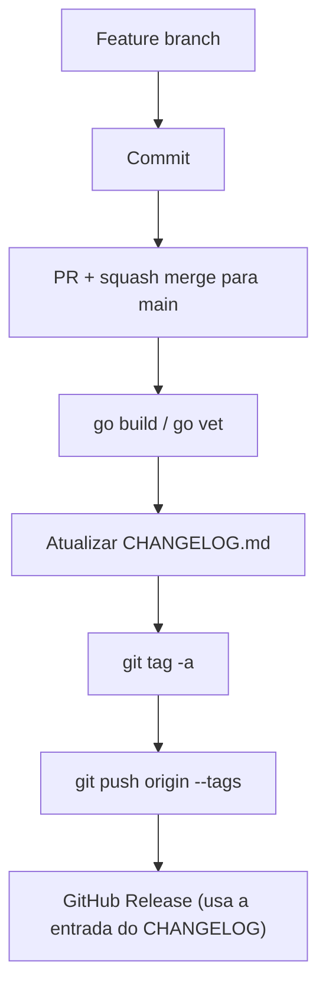
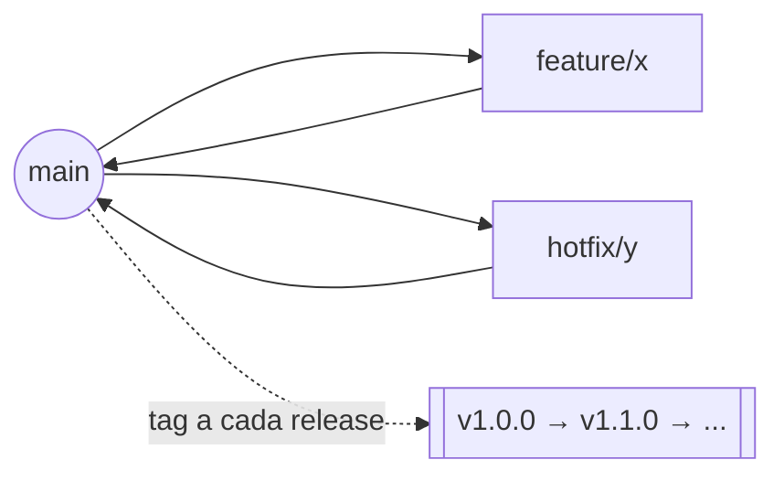

# Guia de Versionamento do Tocli

Este guia explica como o Tocli versiona releases: [Semantic Versioning (SemVer)](https://semver.org/lang/pt-BR/) para números de versão, Git Tags anotadas para marcá-las, e [Keep a Changelog](https://keepachangelog.com/pt-BR/1.0.0/) para documentá-las em [`CHANGELOG.md`](../CHANGELOG.md).

O projeto usou `v0.2.0-alpha` e `v0.5.6-rc-1` antes de `v1.0.0` sem um critério documentado de quando incrementar cada número — este guia formaliza esse critério daqui em diante.

## 1. Conceitos fundamentais

| Conceito | Definição | Exemplo no Tocli |
|---|---|---|
| **Commit** | Snapshot atômico e imutável de mudanças. | `5f1fea3 TUI-04: Add Daily Rating Graph...` |
| **Branch** | Linha de desenvolvimento paralela. | `feat/daily-rating-graph` |
| **Merge** | Une o histórico de uma branch a outra. | Squash merge do PR #6 em `main`. |
| **Release** | Versão publicada, com tag e artefatos. | GitHub Release `v1.0.0`. |
| **Artefato** | Resultado de um build, distribuído. | Binário `tocli`. |
| **Tag** | Ponteiro nomeado e imutável para um commit. | `v1.0.0` → commit `7614749`. |

## 2. Semantic Versioning (SemVer)

Formato: `MAJOR.MINOR.PATCH` (ex.: `1.4.7`). Cada incremento zera os números à direita.

| Campo | Incrementa quando... | Exemplos |
|---|---|---|
| **MAJOR** | Quebra compatibilidade. | Remover uma flag de CLI; mudar a assinatura de `domain.RatingRepository`. |
| **MINOR** | Adiciona funcionalidade compatível. | Daily Rating Graph, notas de dia, exportação CSV (nada quebra). |
| **PATCH** | Correção ou ajuste interno. | Corrigir avisos de `go vet`; ajustar saturação de uma cor. |

- **`0.x.y`**: desenvolvimento inicial — a API pode mudar a qualquer momento, mesmo entre MINORs.
- **Beta**: funcionalidades prontas, ainda em teste ativo.
- **RC** (*release candidate*): só recebe correções, é a última validação antes da versão estável.
- **Estável**: pronta para uso geral.

## 3. Pré-releases

```
1.0.0-alpha   1.0.0-beta   1.0.0-rc.1
```

`alpha` (instável, uso interno) → `beta` (completo, em teste externo) → `rc.N` (só bugfixes, candidata final). Uma pré-release tem precedência menor que a versão final: `1.0.0-rc.1 < 1.0.0`.

## 4. Git Tags

Uma tag é um ponteiro **imutável** para um commit — ao contrário de uma branch, ela não se move.

| Tipo | Guarda autor/data/mensagem? | Quando usar |
|---|---|---|
| Lightweight (`git tag v1.1.0`) | Não | Nunca para releases publicadas. |
| **Annotated** (`git tag -a`) | Sim | **Toda release** — padrão do projeto. |
| Signed (`git tag -s`) | Sim + assinatura GPG | Quando autenticidade precisa ser provável. |

```bash
git tag -a v1.1.0 -m "Daily Rating Graph, notas de dia e exportação CSV"
git push origin v1.1.0
git show v1.1.0          # inspecionar metadados
git tag -d v1.1.0         # apagar localmente (só para corrigir erro recém-cometido)
git push origin --delete v1.1.0
```

Nunca apague ou recrie uma tag já publicada e usada por alguém.

## 5. Fluxo de release



## 6. CHANGELOG

[`CHANGELOG.md`](../CHANGELOG.md) segue **Keep a Changelog**: cada versão tem até estas seções, nesta ordem — `Added`, `Changed`, `Deprecated`, `Removed`, `Fixed`, `Security`. Quem abre o PR que introduz a mudança é quem adiciona a entrada em `[Unreleased]`; ela é renomeada para o número da versão só na hora do release.

## 7. Tag e CHANGELOG andam juntos

**Regra:** a entrada do CHANGELOG é commitada **antes** da tag ser criada — nunca depois.

```
implementação → commit → atualizar CHANGELOG → commit → git tag -a → push da tag → release
```

Se a tag vier primeiro, ela aponta para um commit cujo CHANGELOG ainda não descreve a própria versão — quebra a rastreabilidade que o arquivo deveria garantir.

## 8. Fluxo de branches

O histórico do Tocli já opera em **feature branches direto sobre `main`**, mescladas via PR (sem `develop`) — mantenha esse modelo enxuto em vez de adotar Git Flow completo:



Reserve `hotfix/*` para correções urgentes direto sobre `main`. Só introduza `develop`/`release/*` se a equipe ou o número de versões em manutenção simultânea crescer.

## 9. Exemplos

| Mudança | Versão | CHANGELOG |
|---|---|---|
| Corrige panic ao navegar o gráfico | `1.4.1 → 1.4.2` | `### Fixed` |
| Daily Rating Graph (aditivo) | `1.0.0 → 1.1.0` | `### Added` |
| Renomeia flag `-offline` para `-demo` | `1.1.0 → 2.0.0` | `### Changed` com nota **BREAKING** |

## 10. Boas práticas

- Tag sempre **annotated** (`git tag -a`), nunca lightweight.
- Toda release tem tag; toda tag tem entrada no CHANGELOG — uma sem a outra quebra rastreabilidade.
- Nunca reutilize ou altere uma versão já publicada.
- Evite commits diretos em `main` fora de hotfixes; prefira sempre PR.
- Mantenha `main.go`'s `Version` sincronizado com a tag a cada release.
- Rode `go build ./...` e `go vet ./...` limpos antes de toda tag.

## 11. Erros já encontrados neste repositório

| Erro | Impacto | Correção |
|---|---|---|
| `v0.2.0-alpha`/`v0.5.6-rc-1` eram tags *lightweight*; só `v1.0.0` era anotada. | Histórico de metadados inconsistente entre releases. | Padronizar `git tag -a` a partir de agora. |
| `main.go` tinha `Version = "v0.5.6-rc-1"` enquanto a tag era `v1.0.0`. | Flag `-version` reportava informação errada ao usuário. | Atualizar `Version` a cada release (feito na v1.1.0). |
| Não existia `CHANGELOG.md`. | Nenhuma tag tinha entrada correspondente. | Criado a partir da v1.1.0, com entrada retroativa para v1.0.0. |

## 12. Conclusão

SemVer só comunica risco de fato quando aplicado com disciplina: tag anotada, CHANGELOG correspondente, nenhuma versão pulada sem justificativa. Ao decidir a próxima versão, pergunte primeiro "isso quebra algo?" (MAJOR), depois "isso adiciona algo?" (MINOR), e só então trate como PATCH. `v1.1.0` foi a primeira release do Tocli a seguir este processo por completo.
